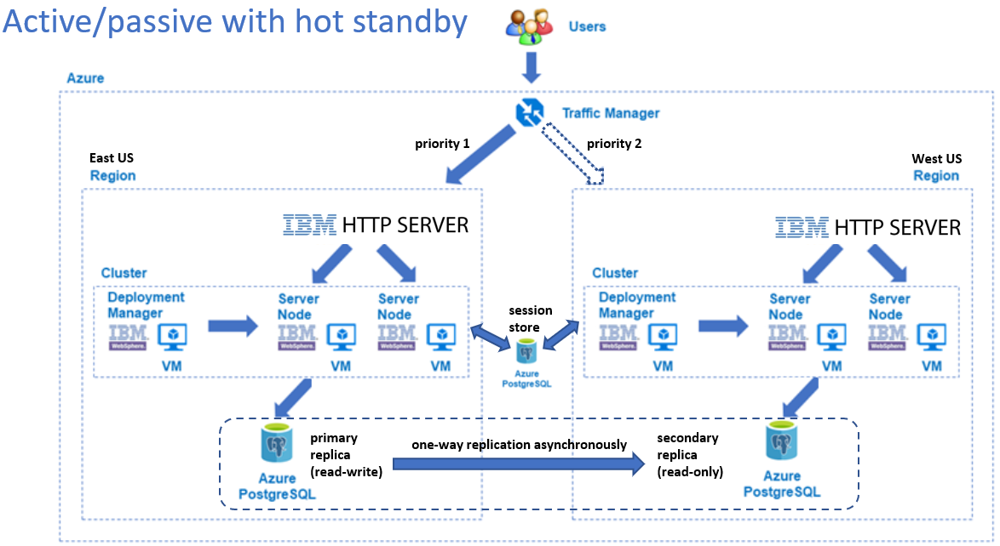
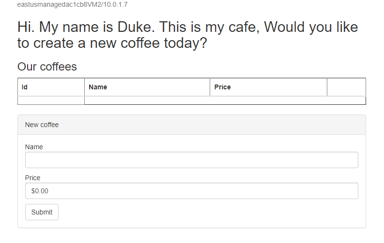

# Deploying a disaster recovery solution of WebSphere on Azure VMs

This guide instructus how you can create an environment to demonstrate the disaster recovery solution of WebSphere on Azure VMs:



## Prerequisites

Make sure the following prerequisites are satisfied before you move on to next steps.

1. You will need an Azure subscription. If you don't have one, you can get one for free for one year [here](https://azure.microsoft.com/free).
1. You will need an entitled IBMid. If you don't have one, you can register one [here](https://www.ibm.com/account/reg/sg-en/signup?formid=urx-19776). Contact IBM to make it entitled.
1. Install a Java SE implementation (for example, [AdoptOpenJDK OpenJDK 8 LTS/OpenJ9](https://adoptopenjdk.net/?variant=openjdk8&jvmVariant=openj9)).
1. Install [Maven](https://maven.apache.org/download.cgi) 3.5.0 or higher.
1. Download this repository somewhere in your file system (easiest way might be to download as a zip and extract).

### Package sample application

A simple CRUD JavaEE application will be deployed to the WebSphere clusters later. Prepare the application package in advance:

1. Locate the path where the repository was downloaded.
1. Change to its sub-dirctory `websphere-cafe`.
1. Compile and package the sample application: `mvn clean package`.
1. The package should be successfully generated and located at `<your local clone of the repo>/websphere-cafe/websphere-cafe-application/target/websphere-cafe.ear`. If you don't see this, you must troubleshoot and resolve the reason why before continuing.

## Setting up Managed PostgreSQL databases on Azure

You will be using the fully managed PostgreSQL offering in Azure to create data store and session store for this demo. Below is how you set it up.

### Setting up the primary replica of the data store

The primary replica will be located in East US region, and connected to the active WebSphere cluster which will be also deployed in East US region later.

1. Go to the [Azure portal](http://portal.azure.com).
1. Select 'Create a resource'. In the search box, enter and select 'Azure Database for PostgreSQL'. Hit Create. Select a single server.
  1. The steps in this section use `<your prefix>`. The prefix could be your first name.  It's suggested to be short, reasonably unique, and less than 10 characters in length.
1. Create and specify a new resource group named `<your prefix>`-demo-postgres. 
1. Specify and log down the Server name to be `<your prefix>`-demo-eastus.
1. Specify the location to be East US.
1. Leave the Version at its default.
1. Specify and log down the Admin username to be `demouser`. 
1. Specify and log down the Password to be `<your unique password>`. 
1. Hit 'Review+create' then 'Create'. It will take a moment for the database to deploy and be ready for use.
1. In the portal, go to 'All resources'. Enter `<your prefix>` into the filter box and press enter.
1. Find and click on `<your prefix>`-demo-eastus. 
1. Under Settings, open the connection security panel.
   1. Toggle "Allow access to Azure services" to "Yes"
   1. Toggle "Enforce SSL connection" to "DISABLED". 
   1. Hit Save. Wait until it completes.

### Setting up the secondary replica of the data store

The sencondary replica will be located in West US region, and connected to the passive WebSphere cluster which will be also deployed in West US region later.

1. Under Settings of the PostgreSQL server (`<your prefix>`-demo-eastus) you created in the previous step, open the Replication panel.
   1. Click "Add Replica" 
   1. Specify and log down the Server name to be `<your prefix>`-demo-westus.
   1. Specify the location to be West US.
   1. Hit OK. Wait until the deployment completes.
1. Once it completes, find it and toggle "Allow access to Azure services" to "Yes" in Settings > Connection security panel, then Save.

### Setting up the session store

The session store is backed up by a standalone PostgreSQL server, and will be configured as database session persistence for both WebSphere clusters later.

As we're going to create another PostgreSQL server, the steps are same as these documented in section [Setting up the primary replica of the data store](#setting-up-the-primary-replica-of-the-data-store), except the following differences/highights:

1. Instead of creating a new resource group, select the existing resource group named `<your prefix>`-demo-postgres. 
1. Specify and log down the Server name to be `<your prefix>`-demo-session.
1. Specify the location to be `Central US`.
1. Specify and log down the Admin username to be `demouser`. 
1. Specify and log down the Password to be `<your unique password>`. 
1. Once it's created, find it with name `<your prefix>`-demo-session and apply the following configurations:
   1. Toggle "Allow access to Azure services" to "Yes"
   1. Toggle "Enforce SSL connection" to "DISABLED". 
   1. Click "Add current client IP address" > Modify the last 4 digits to `0` for value of "Start IP" > Modify the last 4 digits to `255` for value of "End IP" 
   1. Hit Save. Wait until it completes.

You need to create a table to store sessions data now. This guide uses `psql` in Ubuntu as PostgreSQL client. You can use any other alternative per your need.

1. Install PostgreSQL client on Ubuntu:
   
   ```
   wget --quiet -O - https://www.postgresql.org/media/keys/ACCC4CF8.asc | sudo apt-key add -
   echo "deb http://apt.postgresql.org/pub/repos/apt/ `lsb_release -cs`-pgdg main" | sudo tee  /etc/apt/sources.list.d/pgdg.list
   sudo apt update
   sudo apt -y install postgresql-client-12
   ```

1. Connect to the PostgreSQL server and create table `sessions`:
   
   ```
   psql -h <your prefix>-demo-session.postgres.database.azure.com -p 5432 -d postgres -U demouser@<your prefix>-demo-session -W
   ```

   In the prompt, type `<your unique password>` to sign. You will enter into the interaction mode if signed successfully. If not, you must troubleshoot and resolve the reason why before continuing.
   
   In the interactive mode, copy and paste the following content, then hit `Enter` key to commit the command:

   ```
   CREATE TABLE sessions  (
    ID               VARCHAR(128) NOT NULL ,
    PROPID           VARCHAR(128) NOT NULL ,
    APPNAME          VARCHAR(128) NOT NULL,
    LISTENERCNT      SMALLINT ,
    LASTACCESS       BIGINT,
    CREATIONTIME     BIGINT,
    MAXINACTIVETIME  INTEGER ,
    USERNAME         VARCHAR(256) ,
    SMALL            BYTEA  ,
    MEDIUM           TEXT ,
    LARGE            BYTEA
   );
   ```

## Setting up WebSphere clusters on Azure

The next is to get two WebSphere clusters up and running in East US and West US regions. The active cluster is handing the requests routed by the Traffic Manager, and the passive cluster is running in a hot-standby state which means it's not handing the request in the normal situation but will be activated if failover occurs due to the outage of the active cluster.

### Setting up the active WebSphere cluster

Follow the steps below to set up the 1st WebSphere cluser in East US region which acts as an active cluster.

#### Deploy the WebSphere cluster on Azure

You can easily deploy a WebSphere cluster on Azure VMs using the marketplace offer.

1. Go to the [Azure portal](https://ms.portal.azure.com/).
1. Use the search bar on the top to navigate to the Marketplace.
1. In the Marketplace, type in 'IBM WebSphere Application Server Cluster' in the search bar and click Enter.
1. Locate the offer named 'IBM WebSphere Application Server Cluster' and click.
1. Create and specify a new resource group named `<your prefix>`-demo-twas-cluster-eastus.
1. Select the Region to be East US.
1. Specify your entitled IBMid and its password.
1. Check "I accept the IBM License Agreement."
1. Click Next.
1. Specify and confirm "Password for VM administrator". Log down the user name and password as the credential will be used for signing into the operating system of WebSphere server VM later.
1. Specify and confirm "Password for WebSphere administrator". Log down the user name and password as the credential will be used for signing into WebSphere Integrated Solution console later.
1. Click Next.
1. Specify and confirm "Password for VM administrator". The credential isused for signing into the operating system of IBM HTTP Server VM.
1. Specify and confirm "Password for IBM HTTP Server administrator". This credential is used for authenticating with the IBM HTTP Server.
1. Click Next:Review + create
   1. On the Summary blade you must see "Validation passed".  you must troubleshoot and resolve the reason why before continuing.
   1. On the final screen, click Create.
1. It will take some time for the WebSphere cluster to properly deploy. Wait until it completes.
1. Expand "Deployment details" > find new created "Microsoft.Network/networkSecurityGroups" resource ended with "-nsg" > click its name > click inbound security rule "TCP" > append ",22" to the value of field "Destination port ranges" > click "Save". Wait until the save completes.
1. Go back to the deployment page by closing the "Network security group" page, make sure "Deployment details" is expanded.
   1. Find all "Microsoft.Compute/virtualMachines" resources prefixed with "managed" > copy name for each VM
   1. Find "Microsoft.Compute/virtualMachines" resource prefixed with "dmgr" > click its name > copy its "Public IP address" > Open a terminal that supports `ssh` command > ssh to that IP address with WebSphere VM administrator user name and password (`ssh <username>@<ip_address>`). For VMs prefixed with "managed" you copied before, do the followings for each of them:
      1. ssh to the "managed" VM with VM name, WebSphere VM administrator user name and password (`ssh <username>@<vm_name>`)
      1. Change directory to /tmp: `cd /tmp`
      1. Download PostgreSQL JDBC driver: `wget -O postgresql-42.3.2.jar https://jdbc.postgresql.org/download/postgresql-42.3.2.jar`
      1. Return to "dmgr" VM: `exit`
1. Go back to the deployment page by closing the "Virtual machine" page of "dmgr" VM > Open "Outputs" of the deployment page:
   1. Copy and log down value of property "ihsConsole" > Open it in the browser tab > You should see welcome page of "IBM HTTP Server". If you are not able to see the page, you must troubleshoot and resolve the reason why before continuing.
   1. Copy value of property "adminSecuredConsole" > Open it in the browser tab > You should see login page of "WebSphere Integrated Solutions Console" > Sign into the console with the user name and password for WebSphere administrator. If you are not able to sign, you must troubleshoot and resolve the reason why before continuing.

#### Configure data sources for the cluster

It's ready to configure the WebSphere cluster with the required data sources. 

You're going to configure the 1st data source for persisting the application data.
1. Make sure you have signed into the WebSphere Integrated Solutions Console.
1. Click System administration > Console Preferences > Check "Synchronize changes with Nodes" > Apply.
1. Create data source for persisting application data:
   1. Click Resources > JDBC > Data sources.
   1. Select "Cluster=MyCluster" as scope.
   1. Click "New...".
   1. Specify `WebSphereCafeDB` for "Data source name", and `jdbc/WebSphereCafeDB` for "JNDI name".
   1. Click Next.
   1. Select `User-defined` for "Database type", specify `org.postgresql.ds.PGConnectionPoolDataSource` for "Implementation class name".
   1. Click Next.
   1. Replace the defualt value with `/tmp/postgresql-42.3.2.jar` for "Class path".
   1. Click Next.
   1. Click Next to use defaults for all remaining steps till the last one. Click Finish.
   1. Click Save.
   1. Wait until the save completes. Click OK.
   1. Click new created data source `WebSphereCafeDB`.
   1. Click "Custom properties" under section "Additional Properties".
   1. Check if property named "URL" exists. Create one named "URL" if not. Set "jdbc:postgresql://`<your prefix>`-demo-eastus.postgres.database.azure.com:5432/postgres?user=demouser@`<your prefix>`-demo-eastus&password=`<your unique password>`" for field "Value". Click OK.
   1. Click Save. Wait unti completion. Click OK.
   1. Click data source `WebSphereCafeDB` at the top navigation bar > Click "Test connection". There should be messages displayed at the top of the page telling you the test connection operation was successful (ignore the warning from the message). If you are not able to see the similar message, you must troubleshoot and resolve the reason why before continuing.

Then, you will configure the 2nd data source for persisting the application session state. The steps are same as these for configuraing the 1st data source above, except the following differences/highlights:
1. At step "Enter basic data source information", specify `WebSphereCafeSession` for "Data source name", and `jdbc/WebSphereCafeSession` for "JNDI name".
1. At step "Select JDBC provider", select an existing JDBC provider `User-defined JDBC Provider`.
1. Add/update a new/an existing customer property "URL" for data source `WebSphereCafeSession`, set "jdbc:postgresql://`<your prefix>`-demo-session.postgres.database.azure.com:5432/postgres?user=demouser@`<your prefix>`-demo-session&password=`<your unique password>`" for its field "Value".
1. Test connection for data source `WebSphereCafeSession`. If you are not able to see the successful message, you must troubleshoot and resolve the reason why before continuing.

#### Configure database session persistence for the cluster

The next step is to configure database session persistence for all cluster members, so that the session state can be shared between the two clusters in different regions.

1. Click Servers > All servers. You should see a list of cluster members prefixed with "MyCluster_" and an IBM HTTP Server named "webserver1"
1. Repeat the following steps for each of cluster members:
   1. Click to open the cluster member server.
   1. Click "Session management" under section "Container Settings".
   1. Click "Distributed environment settings" under section "Additional Properties".
   1. Check "Database (Supported for Web container only.)" for "Distributed sessions".
   1. Click "Database".
   1. Specify `jdbc/WebSphereCafeSession` for "Datasource JNDI name", `demouser@<your prefix>-demo-session` for "User ID", `<your unique password>` for "Password", `sessions` for "Table space name", and check "Use multi row schema". Click OK.
   1. Click Save. Wait until completion.
   1. Click "Distributed environment settings" at the top navigation bar.
   1. Click "Custom tuning parameters" under section "Additional Properties".
   1. Check "Low (optimize for failover)" for "Tuning level". Click OK.
   1. Click Save. Wait until completion.
   1. Click "Middleware servers" at the top navigation bar.
1. Click Servers > Clusters > WebSphere application server clusters > Check MyCluster.
1. Click Ripplestart. 
1. Hover the mouse over the status icon. If the tool tip doesn't show "Started", click the refresh icon at the right of column "Status" and wait a few seconds. Repeat the operation until the status icon turns into "Started".

#### Deploy the sample application to the cluster

After all required data sources are configured, you are able to deploy the sample application to the cluster.

1. In the left navigation area, click "Applications" > "Application Types" > "WebSphere enterprise applications".
1. Click "Install" > "Choose File" > select the package located at `<your local clone of the repo>/websphere-cafe/websphere-cafe-application/target/websphere-cafe.ear` > click Open > click "Next" > "Next" > "Next" > Press Ctrl and click all items listed in "Clusters and servers", select all modules, click "Apply" > click "Next" > click "Next" > click "Finish" > click "Save" > click "OK" unless you see all nodes are synchronized.
1. Check installed application "websphere-cafe" > Click "Start" > Wait until you see messages indicating application successfully started. If you are not able to see the successful message, you must troubleshoot and resolve the reason why before continuing.

### Setting up the passive WebSphere cluster

Follow the same steps in section [Setting up the active WebSphere cluster](#setting-up-the-active-websphere-cluster) to create and configure the 2nd WebSphere cluser in West US region which acts as a passive cluster, except the following differnces/highlights:

1. In section "Deploy the WebSphere cluster on Azure":
   1. Create and specify a new resource group named `<your prefix>`-demo-twas-cluster-westus.
   1. Select the Region to be West US.
1. In section "Configure data sources for the cluster"
   1. Check if property named "URL" exists for new created data source `WebSphereCafeDB`. Create one named "URL" if not. 
   1. Set "jdbc:postgresql://`<your prefix>`-demo-westus.postgres.database.azure.com:5432/postgres?user=demouser@`<your prefix>`-demo-westus&password=`<your unique password>`" for its field "Value".

## Setting up Azure Traffic Manager

You will be using the Azure Traffic Manager to route the user requests to the active WebSphere cluster deployed on East US region or the passive cluster deployed on West US region.

1. Go to the [Azure portal](http://portal.azure.com).
1. Select 'Create a resource'. In the search box, enter and select 'Traffic Manager profile'. Hit Create.
1. Specify `<your prefix>`-demo for "Name".
1. Select Priority for "Routing method".
1. Select appropirate subscription.
1. Create and specify a new resource group named `<your prefix>`-demo-traffic-manager. 
1. Hit 'Create'. Wait until the deployment completes.
1. In the portal, go to 'All resources'. Enter `<your prefix>`-demo-traffic-manager into the filter box and press enter.
1. Find and click on `<your prefix>`-demo. 
1. Under Settings, open the Endpoints panel. You're going to add two IBM HTTP Server instances as external endopoints.
   1. Click "+Add".
   1. Select "External endpoint" for "Type".
   1. Specify "ihs-eastus" for "Name".
   1. Find the value copied from "ihsConsole" in the output of the deployment for the cluster deployed in East US region, removed the starting "http://" and set the remaining for "Fully-qualified domain name (FQDN) or IP".
   1. Hit Save. Wait until it completes.
   1. Click "+Add" again to add another IBM HTTP Server deployed in the West US region by following the same steps above, but set "ihs-westus" for "Name", find the value copied from "ihsConsole" in the output of the deployment for the cluster deployed in West US region. Make sure the value of Priority is 2.
   1. Wait until the value of "Monitoring status" for both endpoints are changed from "Checking endpoint" to "Online". You can manually click Refresh to update the status.
1. Switch back to "Overview" panel, find and copy the value for "DNS name", open a new tab of the browser, paste the copied value into the address bar, append `/websphere-cafe`, and hit `Enter` key. You will see the UI of the sample application:

   

   If you don't see this, you must troubleshoot and resolve the reason why before continuing. 

## Demonstrating the disaster recovery of the solution

You have set up all of components of the solutoin, and deployed a sample application for the demonstration of disaster recovery, congratulations! 

The next step is to show you how to demo the solution works.

### The active WebSphere cluster serves user requests

Normally, all user requests should be routed to the active WebSphere cluster deployed in East US region:

1. Return to the UI of the sample application you just opened.
1. Observe that the hostname of the server at the left-top of the page is from one of the cluster members deployed in the East US region.
1. Create a new coffee with a name and the price, which will be persisted into both the data store and session store.
1. Observe that the new coffee is added to the list of coffees.

### Simulate outage of the active cluster 

You can simulate the outage of the active cluster by stopping the web server deployed in the East US region:

1. Find and sign into the WebSphere Integrated Solution console of the cluster deployed in the East US region.
1. Find `webserver1` by clicking Servers > Server Types > Web servers.
1. Select webserver1 and click Stop.
1. Observe the "Monitoring status" for `ihs-eastus` in the overview of traffic manager, and wait until it's changed from `Online` to `Degraded`.
1. Refresh the UI of sample app.
1. Observe the hostname of the server is changed to one of the servers deployed in the West US region
1. Observe all of coffees are listed due to the auto replication from primary replica to the secondary replica
1. Observe the values of the name and the price for the new created coffee are retained due to the database session persistence

This demonstrates the system automatically failovers to the passive cluster in case the active cluster is down.

### Verify the secondary replica is read-only

In the failover system, the database with the data automatically replicad from the primary replica to the secondary replica is read-only.

1. Try to create another coffee by specifying a different name and price in the coffee creation form, click Create.
1. Observe that no new coffee is added to the coffee list due to the read-only nature of the secondary replica.

### Simulate recovery of the active cluster

You can simulate the recovery of the active cluster by starting the web server deployed in the East US region:

1. Select webserver1 from the WebSphere Integrated Solution console and click Start.
1. Observe the Monitoring status for `ihs-eastus` in the overview of traffic manager, and wait until it's changed from `Degraded` to `Online`.
1. Refresh the UI of sample app.
1. Observe the hostname of the server is changed back to one of the servers deployed in the East US region due to the traffic manager.
1. Observe the values of the name and the price for the coffee failed to be created before are still retained due to the database session persistence.

Congrats! You have done the demonstration of the disaster recovery solution you just set up! 

## Cleaning Up

Once you are done exploring all aspects of the demo, you should delete all the resources deployed on Azure. This is especially important if you are not using a free subscription! If you do keep these resources around (for example to begin your own prototype), you should at least use your own and secured passwords and make the corresponding changes in the demo code if needed.

To delete resources, go to resource groups, type "`<your prefix>`-demo" and you should find 4 resource groups listed:
* `<your prefix>`-demo-traffic-manager
* `<your prefix>`-demo-twas-cluster-eastus
* `<your prefix>`-demo-twas-cluster-westus
* `<your prefix>`-demo-postgres

Click each of the resource groups and hit Delete resource group. 
